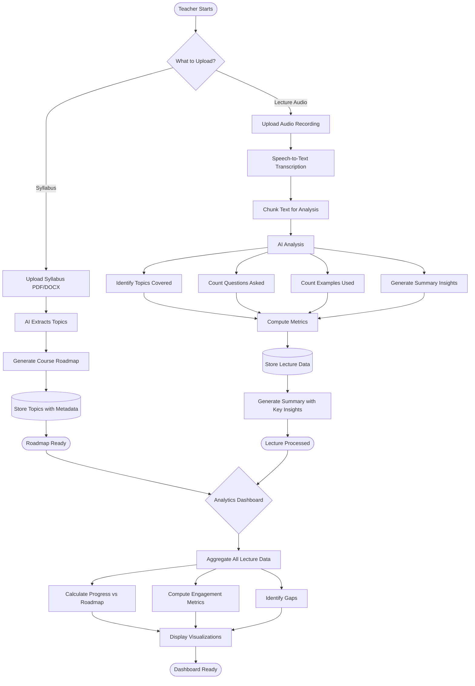

# Prof-Dash 📚

**AI-Powered Classroom Analytics & Lecture Tracking Assistant**

Teaching Aid helps educators analyze their teaching habits, track student engagement, and monitor classroom performance through automated lecture transcription, AI-generated summaries, and comprehensive analytics. Built for teachers who need efficient classroom review with data-driven insights.

> **⚠️ Important:** This tool **assists** teachers—it does **not** replace professional judgment or comprehensive teaching evaluation. Every insight should be reviewed in context of your classroom environment. This is an analytical aid, not a replacement for teacher expertise.

---

## 🎬 Demo

[](#)

*Demo video coming soon*

---

## 🎯 Use Cases We Cover

**What This Tool Does:**

1. **Syllabus Roadmap Generation**
   - Upload course syllabus (PDF/Word format)
   - AI generates complete course topic roadmap
   - Visual timeline of topics to be covered
   - Automatic topic hierarchy and dependencies

2. **Lecture Audio Analysis**
   - Upload audio recordings of lectures
   - Automatic transcription to text
   - AI-generated lecture summaries
   - Extraction of topics covered that day
   - Identification of key points and concepts

3. **Student Engagement Tracking**
   - Tracks number of questions asked during lecture (using Transcript)
   - Identifies which topics generated most questions
   - Provides engagement metrics per lecture 
   - Historical engagement trends across sessions

4. **Teaching Progress Monitoring**
   - Counts examples used in each lecture
   - Tracks topics covered vs. topics missed
   - Compares actual progress against syllabus roadmap
   - Identifies topics needing more attention

5. **Classroom Analytics Dashboard**
   - Aggregated statistics across all lectures
   - Student participation trends
   - Topic coverage completion percentage
   - Teaching style metrics (examples used vs doubts asked  , Off topic trend)
   - Practice question generation 


**What This Tool Does NOT Do:**
- ❌ Grade assignments or exams
- ❌ Replace teacher assessment or evaluation
- ❌ Monitor individual student performance
- ❌ Record video or identify students

---

## 🗺️ Architecture

### Data Flow

**Upload Pipeline:** Teacher uploads syllabus → AI extracts topics and generates roadmap → Topics stored with metadata. **Lecture Pipeline:** Audio recording uploaded → Speech-to-text transcription → Text chunked and analyzed → AI identifies topics covered, questions asked, examples used → Metrics computed and stored → Summary generated with key insights.

**Analytics Pipeline:** All lecture data aggregated → Progress calculated against syllabus roadmap → Engagement metrics computed → Trends identified → Dashboard displays visualizations and insights.


---

## 🛠️ Tech Stack

Analyzing the provided backend and frontend files, here is the comprehensive tech stack used for the **Professor Lecture Analytics** application.


### 💻 Frontend

The frontend uses **Vite** with **React 19** and supporting libraries for routing and data visualization.

- **Core Framework / Compiler:** Vite  
- **Library:** React 19 (`19.2.0`)  
- **Data Visualization:** Chart.js (`^4.5.1`) via **react-chartjs-2** (`^5.3.0`)  
- **Routing:** react-router-dom (`^7.9.4`) for client-side navigation  
- **Tooling / Linting:** ESLint 9 with plugins for React Hooks and React Refresh  


### ⚙️ Backend

The backend is a Python API using modern tools for web development, database management, and AI processing.

- **Web Framework:** FastAPI (used in `main.py` for routing and dependency injection)  
- **Database / ORM:** SQLAlchemy (using `Session` and `text` for database interaction; SQLite as per `database.py`)  
- **LLM Integration:** OpenAI Python Client  
- **File Parsing:** PyPDF2 (for `.pdf`) and python-docx (for `.docx`)  
- **Topic Modeling:** Gensim and NLTK (specifically for LDA and stop word processing)  
- **Environment Management:** python-dotenv  


### 🧠 AI Pipeline & Models

The application utilizes a multi-step AI pipeline combining proprietary LLMs and open-source NLP techniques.

- **Audio Transcription:** OpenAI Whisper (`model="whisper-large-v3"`)  
- **Syllabus Parsing:** LLaMA 3.1 70B Instruct (`llama-3.1-70b-instruct`)  
- **Lecture Analysis & Notes:** LLaMA 3.3 70B Instruct (`llama-3.3-70b-instruct`)  
- **Unsupervised Topic Extraction:** Latent Dirichlet Allocation (LDA) via Gensim  

**Core AI Tasks:**

1. Audio-to-text conversion  
2. Structured content extraction (topics, questions, examples, key points)  
3. Syllabus comparison and coverage calculation (semantic topic matching is implied; currently, simple string comparison is implemented)  
4. Pedagogical note generation  

---

## 📋 Features Breakdown

### 1. Syllabus Roadmap
- **Input:** Course syllabus (PDF/DOCX)
- **Output:**
  - Complete topic hierarchy
  - Estimated timeline per topic
  - Visual roadmap with milestones

### 2. Lecture Transcription & Summary
- **Input:** Audio recording (MP3)
- **Output:**
  - Full text transcript
  - Lecture summary 
  - Topics covered that day
  - Key concepts emphasized
  - Question asked in lecture
  - Exampoles used by Instructure

### 3. Student Engagement Metrics
- **Tracked Metrics:**
  - Total questions asked
  - Questions per topic
  - Average questions per lecture
  
### 4. Teaching Tracker
- **Tracked Metrics:**
  - Number of examples used
  - Examples per topic
  - Topics fully covered
  - Topics partially covered
  - Topics not yet addressed
  - Progress % against syllabus
  - Off Topic trend 

---

## 🧩 Installation

### 🧰 Prerequisites

- **Node.js:** 18+  
- **Python:** 3.10+  
- **API Keys Required:**  
  - OpenAI (for Whisper and LLaMA 3.3 70B Instruct)  

### Backend Setup

```bash
cd backend
python -m venv venv

# Windows
.\venv\Scripts\activate
# macOS/Linux
source venv/bin/activate

pip install -r requirements.txt
```

Create `backend/.env`:
```env
# Enter your API keys

OPENAI_API_KEY=your_openai_api_key

```

Run backend:
```bash
uvicorn main:app --reload 
```

Backend: `http://localhost:8000` | API docs: `http://localhost:8000/docs`

---

### Frontend Setup

```bash
cd frontend
npm install  # or pnpm install / yarn install
npm run dev  # or pnpm dev / yarn dev
```

Frontend: `http://localhost:3000`

---

## 📖 How to Use

### Step 1: Create a Course
1. Click on add Sylubass 
2. Upload your syllabus (PDF, DOCX)
3. AI generates a complete topic roadmap

### Step 2: Upload Lecture Audio
1. Click on right end coner and select lecture 
2. Click "Upload Lecture"
3. Choose audio file from your recording
4. System processes audio and generates transcript

### Step 3: Review Lecture Summary
1. Go to Report 
2. Check Summary of that class also topics covered that day
3. Review key concepts highlighted
4. See student questions tracked

### Step 4: Monitor Progress
1. Open "Class Analytics Dashboard"
2. View syllabus progress percentage
3. Check engagement metrics
4. See student questions tracked
5. Identify topics wise questions asked by student 

### Step 5: Plan Next Lecture
1. See which topics were missed
2. Review student question patterns
3. Adjust teaching approach based on insights
4. Prepare examples for upcoming topics
   
---
## 📊 Project Structure

```
backend/
  ├── analytics.py         # Analytics and metrics computation
  ├── database.py          # SQLite database setup
  ├── main.py              # FastAPI app entry point
  ├── models.py            # SQLModel schemas (Course, Lecture, etc.)
  ├── processing.py        # Audio transcription and text processing
  ├── requirements.txt     # Python dependencies
  ├── schemas.py           # Pydantic request/response schemas
  └── syllabus_tracker.py  # Syllabus parsing and topic extraction

frontend/
  ├── public/
  │   └── vite.svg         # Vite logo
  ├── src/
  │   ├── assets/          # Static assets (images, icons)
  │   │   ├── red-bar-graph.png
  │   │   ├── students-icon.svg
  │   │   └── tiny-bar-chart3.png
  │   ├── components/      # React components
  │   │   ├── report/      # Report-related components
  │   │   │   ├── ClassesPanel.jsx
  │   │   │   ├── QuizPanel.jsx
  │   │   │   ├── SummaryPanel.jsx
  │   │   │   └── TeacherNotesPanel.jsx
  │   │   ├── Roadmap/     # Roadmap/Syllabus components
  │   │   │   ├── LectureSection.css
  │   │   │   ├── LectureSection.jsx
  │   │   │   ├── Roadmap.css
  │   │   │   ├── Roadmap.jsx
  │   │   │   ├── TopicItem.css
  │   │   │   └── TopicItem.jsx
  │   │   ├── ClassSummary.jsx
  │   │   ├── QuestionsPanel.css
  │   │   ├── QuestionsPanel.jsx
  │   │   ├── TeacherProfile.css
  │   │   ├── TeacherProfile.jsx
  │   │   ├── TopicsPanel.css
  │   │   └── TopicsPanel.jsx
  │   ├── pages/           # Page components
  │   ├── App.css          # Global styles
  │   ├── App.jsx          # Root component
  │   ├── index.css        # Base CSS
  │   └── main.jsx         # React entry point
  ├── index.html           # HTML template
  ├── package.json         # Node dependencies
  ├── package-lock.json    # Dependency lock file
  └── vite.config.js       # Vite configuration

.gitignore               # Git ignore rules
eslint.config.js         # ESLint configuration
README.md                # Project documentation
```

---

## 💡 Benefits

**For Teachers:**
- Stay organized with automated lecture summaries
- Track teaching progress against syllabus goals
- Identify topics that need more examples or clarification
- Save time on manual note-taking and review

**For Classroom Improvement:**
- Data-driven insights into student engagement
- Identify which topics generate most questions
- Monitor teaching patterns and adjust approach
- Evidence-based planning for future lectures
- Know the times when teachers goes off topic 

**For Accountability:**
- Document all topics covered 
- Track completion percentage of syllabus
- Export reports for academic review
- Maintain historical record of teaching activities

---

## 🔐 Privacy & Data Handling

- **No student identification:** System tracks aggregate questions, not individual students
- **Audio privacy:** Recordings are processed and can be deleted after transcription
- **Local storage:** All data stored locally or on your chosen server
- **Secure API:** All external API calls use encrypted connections
- **Data export:** You own all transcripts, summaries, and analytics

---

## 🛣️ Roadmap

**Coming Soon:**
- [ ] Multi-language transcription support
- [ ] Integration with Learning Management Systems (LMS)
- [ ] Automated quiz generation from lecture content
- [ ] Sentiment analysis of student questions
- [ ] Mobile app for on-the-go lecture recording
- [ ] Comparison analytics across multiple courses
- [ ] AI-powered teaching recommendations

---
## 👥 Team Contributors

| **Name** | **Role / Responsibilities** |
| -------- | --------------------------- |
| Mihir Bagadia | Project Manager, Gen AI Developer, Prompt Engineer |
| Sibi Seenivasan | Backend Developer, Database Manager, Frontend-Backend Integrator |
| Amilcar Suarez | Frontend Developer, Dashboard Designer, Frontend-Backend Integrator |
|Heril Jain | - |

> **Note:** This project was a collaborative effort combining AI development, backend engineering, frontend development, and data visualization to create a comprehensive teaching aid for educators.


---

## 📧 Contact

| **Name**   | **Email**                     | **LinkedIn**                                          |
|------------|-------------------------------|------------------------------------------------------|
| Mihir      | mihirvbagadia@gmail.com       | [LinkedIn](https://www.linkedin.com/in/mihir-bagadia) |
| Sibi       | sibiseenivasan@gmail.com      | [LinkedIn](https://www.linkedin.com/in/sibi-seenivasan/) |
| Amilcar    | AmilcarSuarez3rd@gmail.com    | [LinkedIn](https://www.linkedin.com/in/amilcar-suarez-33914b390/) |

---

**Built with ❤️ for educators**
